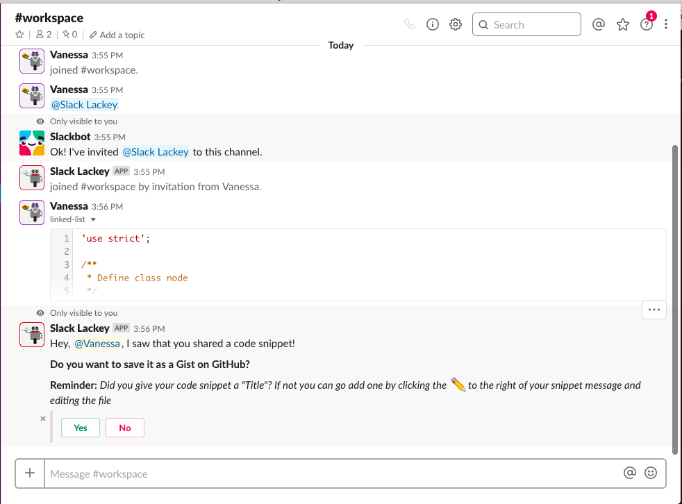
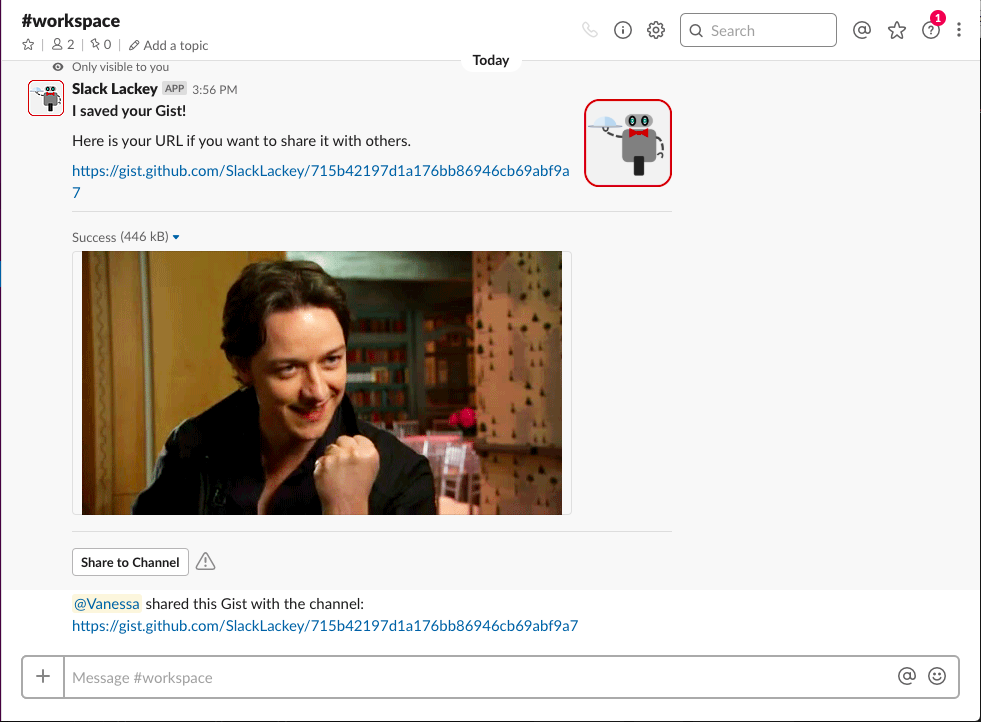

Slack Lackey is a chat bot built with NodeJS, MongoDB, GitHub's API, and several of Slack's APIs. When Slack Lackey is installed to a Slack workspace and invited to a channel, the bot will detect any code within messages (a code snippet or code block) and privately ask the sender if they'd like to save a gist on GitHub. If the user accepts, the app saves the code as a gist and sends the user a link. The app also presents the user an option to share the link publicly with the channel.

This project solves a problem my peers and I faced daily: losing important code snippets we'd sent each other in Slack because we didn't have a paid workspace. My team of four had only four days to build this back-end-only project and give a presentation on our work.

This project includes two separate applications: 
- The [bot server](https://github.com/slack-lackey/bot-server) which listens in to the Slack workspace to send messages and ping the GitHub server on certain events (deployed with AWS). It also stores the gist date, author, and keywords in a MongoDB (through [mLab](https://mlab.com/))
- The [GitHub server](https://github.com/slack-lackey/api-server) which takes requests from the bot server, creates a gist on GitHub, and responds with a gist URL (deployed with Heroku).

I'm proud of what my small team accomplished in only four days—we dove deep into the Slack and GitHub API docs, deployed apps with two different providers, and had a live, deployed demo ready to present.

